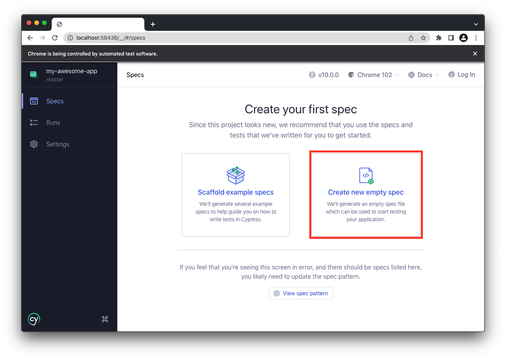
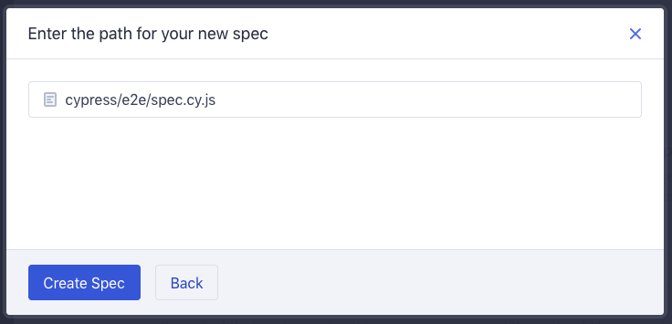
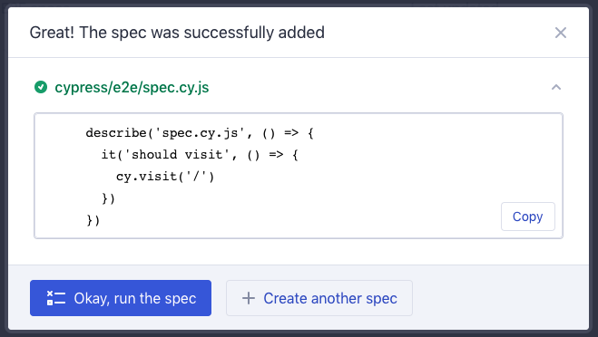
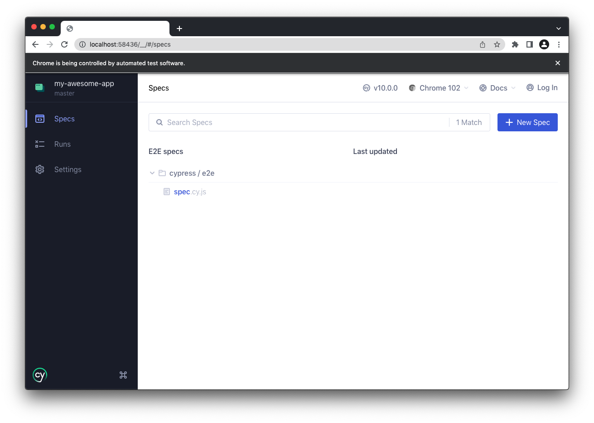
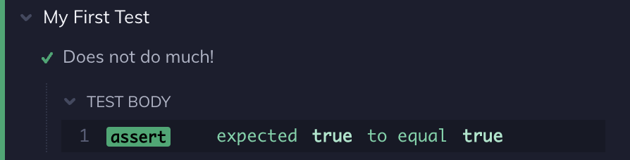
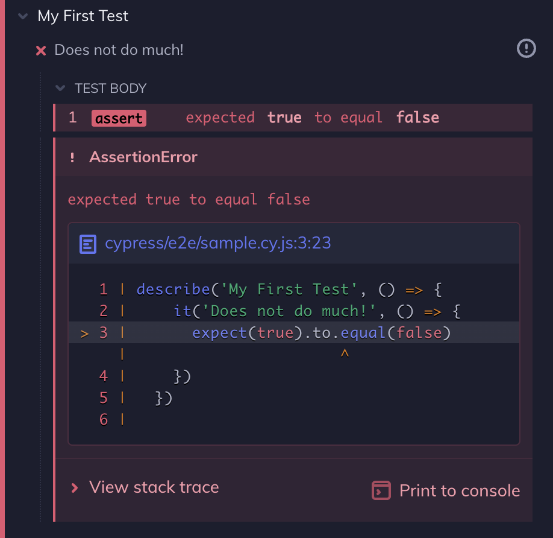

# Escribir su Primera Prueba E2E

:::info Lo que aprenderás
- Cómo comenzar a probar un nuevo proyecto en Cypress.
- Cómo se ven las pruebas para aprobar y reprobar.
- Prueba de navegación web, consultas DOM y escritura de aserciones.
:::

## Agregar un archivo de prueba

Suponiendo que [instaló Cypress](../cypress-get-start/instalando-cypress.html) con éxito y [abrió Cypress](../cypress-get-start/abriendo-la-aplicacion.html), ahora es el momento de agregar su primera prueba. Vamos a hacer esto con el botón **Create new empty spec**.



Al hacer clic en él, debería ver un cuadro de diálogo donde puede ingresar el nombre de su nueva **spec**. Simplemente acepte el nombre predeterminado por ahora.




La **spec** recién generada se muestra en un cuadro de diálogo de confirmación. Simplemente continúe y ciérrelo con el botón `X`.




Una vez que hayamos creado ese archivo, debería verlo inmediatamente en la lista de **specs** de un extremo a otro. Cypress supervisa sus archivos de **specs** en busca de cambios y los muestra automáticamente.



Aunque todavía no hemos escrito ningún código, está bien, hagamos clic en su nueva **specs** y veamos cómo Cypress la lanza. Alerta de revelación: probablemente va a FALLAR. ¡No se preocupe, es solo porque aún no ha configurado Cypress para visitar una página en su aplicación! Probemos algo diferente.

## Escribe tu primera prueba

Ahora es el momento de escribir su primera prueba. Iremos a:

1. Escriba su primera prueba de aprobación.
2. Actualízalo para que falle.
3. Mira Cypress recargar en tiempo real.

Abra su IDE favorito y reemplace el contenido de su especificación con el código a continuación.

```js
describe('My First Test', () => {
  it('Does not do much!', () => {
    expect(true).to.equal(true)
  })
})
```

Una vez que guarde este cambio, debería ver que el navegador se vuelve a cargar.

Aunque no hace nada útil, ¡esta es nuestra primera prueba de aprobación! ✅

En el [registro de comandos](https://docs.cypress.io/guides/core-concepts/cypress-app#Command-Log), verá que Cypress muestra la suite, la prueba y su primera afirmación (que debería pasar en verde).



>Observe que Cypress muestra un mensaje acerca de que esta es la página predeterminada [en el lado derecho](https://docs.cypress.io/guides/end-to-end-testing/writing-your-first-end-to-end-test#Write-your-first-test). Cypress supone que querrá salir y [visitar](https://docs.cypress.io/api/commands/visit) una URL en Internet, pero también puede funcionar bien sin eso.

Ahora escribamos nuestra primera prueba fallida.

```js
describe('My First Test', () => {
  it('Does not do much!', () => {
    expect(true).to.equal(false)
  })
})
```

Una vez que guarde nuevamente, verá que Cypress muestra la prueba fallida en rojo, ya que `true` no es igual a `false`.

Cypress también muestra el seguimiento de la pila y el marco de código donde falló la aserción (si está disponible). Puede hacer clic en el enlace del archivo azul para abrir el archivo donde ocurrió el error en [su abridor de archivos preferido](https://docs.cypress.io/guides/tooling/IDE-integration#File-Opener-Preference). Para obtener más información sobre la visualización del error, lea sobre [Errores de Depuración](https://docs.cypress.io/guides/guides/debugging#Anatomy-of-an-error).



:::info ¿Qué son **describe**, **it** y **expect**?

Todas estas funciones provienen de las [Bibliotecas Agrupadas](https://docs.cypress.io/guides/references/bundled-libraries) que Cypress integra.

- `describe` e `it` vienen de [Mocha](https://mochajs.org/).
- `expect` viene de [Chai](https://www.chaijs.com/).

Cypress se basa en estas herramientas y _frameworks_ populares con los que, con suerte, ya tienes cierta familiaridad y conocimiento. Si no, también está bien.
:::

:::tip ¿Usas ESlint?
Consulte el [complemento Cypress ESLint](https://github.com/cypress-io/eslint-plugin-cypress).
:::

## Escribe una prueba _real_

**Una prueba sólida generalmente cubre 3 fases:**

1. Configure el estado de la aplicación.
2. Toma una acción.
3. Haga una afirmación sobre el estado de la aplicación resultante.

También puede ver esto expresado como _"Dado, Cuándo, Entonces"_ o _"Arreglar, Actuar, Afirmar"_. Pero la idea es: primero coloca la aplicación en un estado específico, luego realiza alguna acción en la aplicación que hace que cambie y, finalmente, verifica el estado de la aplicación resultante.

Hoy, tomaremos una visión limitada de estos pasos y los asignaremos limpiamente a los comandos de Cypress:

1. Visite una página web.
2. Consulta por un elemento.
3. Interactuar con ese elemento.
4. Afirmar sobre el contenido de la página.

## Paso 1: Visita una página

Primero, visitemos una página web. Visitaremos nuestra aplicación [Kitchen Sink](https://docs.cypress.io/examples/examples/applications#Kitchen-Sink) en este ejemplo para que pueda probar Cypress sin tener que preocuparse por encontrar una página para probar.

Podemos pasar la URL que queremos visitar a [`cy.visit()`](https://docs.cypress.io/api/commands/visit). Reemplacemos nuestra prueba anterior con la siguiente que realmente visita una página:

```js
describe('My First Test', () => {
  it('Visits the Kitchen Sink', () => {
    cy.visit('https://example.cypress.io')
  })
})
```
Guarde el archivo y vuelva a cambiar a Cypress Test Runner. Es posible que notes algunas cosas:

1. El [registro de comandos](https://docs.cypress.io/guides/core-concepts/cypress-app#Command-Log) ahora muestra la nueva acción `VISIT`.
2. La aplicación Kitchen Sink se cargó en el panel de [Vista Previa de la Aplicación](https://docs.cypress.io/guides/core-concepts/cypress-app#Overview).
3. La prueba es verde, aunque no hicimos afirmaciones.
4. La `VISIT` muestra un **estado pendiente azul** hasta que la página termina de cargarse.

Si esta solicitud hubiera regresado con un código de estado que no es `2xx`, como `404` o `500`, o si hubiera un error de JavaScript en el código de la aplicación, la prueba habría fallado.

<video controls>
  <source src="./img/first-test-visit-30fps.629ca43.mp4">
</video>


::: info Probar Aplicaciones Que No Controlas

En esta guía estamos probando nuestra aplicación de ejemplo: https://example.cypress.io. Sin embargo, debe pensar detenidamente en probar aplicaciones que **no controla**. ¿Por qué?

- Tienen el potencial de cambiar en cualquier momento, lo que romperá las pruebas.
- Pueden hacer pruebas A/B, lo que hace que sea imposible obtener resultados consistentes.
- Pueden detectar que usted es un script y bloquear su acceso.
- Es posible que tengan funciones de seguridad habilitadas que impiden que Cypress funcione.

En términos generales, el objetivo de Cypress es ser una herramienta que use todos los días para crear y probar sus propias aplicaciones, no una herramienta de automatización web de propósito general. Sin embargo, esta es una guía más que una regla estricta y hay varias buenas razones para hacer excepciones para ciertos tipos de aplicaciones:

- Están diseñados específicamente para integrarse con terceros, p. Proveedores de SSO.
- Le brindan un servicio complementario, p. Paneles de control SaaS o analítica.
- Reutilizan su contenido o proporcionan complementos para una aplicación que usted controla.

La clave aquí es sopesar cuidadosamente los beneficios de las pruebas en cuestión frente a la posible interrupción y escamas que pueden introducir este tipo de pruebas.
:::

## Paso 2: Consulta de un elemento


