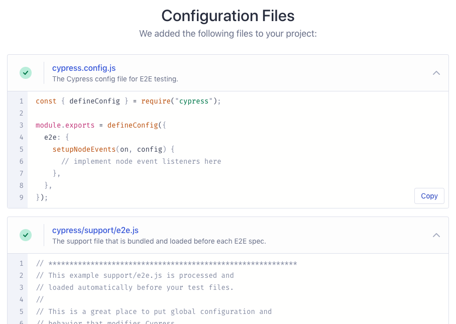
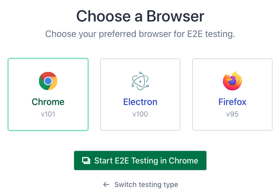

# Abriendo la Aplicación

:::info Lo que aprenderás
- Cómo iniciar Cypress desde la línea de comandos
- Cómo comenzar su viaje de prueba con el Launchpad
- Cómo elegir un tipo de prueba
- Cómo iniciar un navegador
:::

## `cypress open`

Ahora puede abrir Cypress desde la raíz de su proyecto de una de las siguientes maneras:

**Usando `npx`**

Nota: [npx](https://www.npmjs.com/package/npx) se incluye con `npm > v5.2` o se puede instalar por separado.

```bash
npx cypress open
```

**O usando `yarn`**

```bash
yarn run cypress open
```

**El camino largo con la ruta completa**

```bash
./node_modules/.bin/cypress open
```

**O con el atajo usando npm bin**

```bash
$(npm bin)/cypress open
```

Después de un momento, se abrirá Cypress Launchpad.

## Agregar scripts npm

Si bien no hay nada de malo en escribir la ruta completa al ejecutable de Cypress cada vez, es mucho más fácil y claro agregar comandos de Cypress al campo de `scripts` en su archivo `package.json`.

```json
{
  "scripts": {
    "cypress:open": "cypress open"
  }
}
```

Ahora puede invocar el comando desde la raíz de su proyecto así:

```bash
npm run cypress:open
```

...y Cypress se abrirá justo para ti.


## Herramientas CLI

Al instalar Cypress a través de `npm`, también obtiene acceso a muchos otros comandos CLI. Además de eso, Cypress también es una biblioteca de JavaScript completamente horneada que puede importar a sus scripts de Node.

Puede [leer más sobre la CLI aquí](https://docs.cypress.io/guides/guides/command-line).

## El Launchpad

>Plataforma de lanzamiento


Al abrir Cypress, su viaje de prueba comienza con el Launchpad. Su trabajo es guiarlo a través de las decisiones y las tareas de configuración que debe completar antes de comenzar a escribir su primera prueba.

Si es la primera vez que usa Cypress, lo llevará a través de los siguientes pasos en orden.


## Elegir un Tipo de Prueba


El Launchpad le presenta primero su decisión más importante: ¿Qué tipo de prueba debo hacer? ¿[Pruebas E2E](https://docs.cypress.io/guides/core-concepts/testing-types#What-is-E2E-Testing), donde ejecuto toda mi aplicación y visito páginas para probarlas? ¿O [prueba de componentes](https://docs.cypress.io/guides/core-concepts/testing-types#Common-scenarios-for-end-to-end-tests), donde monto componentes individuales de mi aplicación y los pruebo de forma aislada?

Para obtener más información sobre esta decisión crítica, lea [Tipos de Pruebas](https://docs.cypress.io/guides/core-concepts/testing-types). Alternativamente, si no está seguro de qué tipo quiere y solo quiere continuar con su viaje de prueba, simplemente elija **E2E** por ahora, ¡siempre puede cambiar esto más adelante!

## Configuración Rápida



En el siguiente paso, el Launchpad desplegará un conjunto de archivos de configuración apropiados para el tipo de prueba elegido y los cambios se enumerarán para que los revise. Para obtener más información sobre la configuración generada, consulte la [referencia de configuración de Cypress](https://docs.cypress.io/guides/references/configuration), o simplemente puede desplazarse hacia abajo y presionar _"Continue"_.


## Lanzamiento de un Navegador



Por último, se le presenta la lista de navegadores compatibles que Cypress encontró en su sistema. Para comprender más acerca de sus opciones aquí, consulte [la guía sobre cómo lanzar navegadores](https://docs.cypress.io/guides/guides/launching-browsers). Nuevamente, no se preocupe, puede cambiar de navegador cuando lo desee. ¡Ahora **APRIETE ESE BOTÓN DE INICIO**!


## Próximos Pasos

¡Hora de hacerse la prueba! Si elige [comenzar con E2E Testing, vaya aquí](../cypress-e2e/primera-prueba-E2E.html). Alternativamente, si decidió [intentar con pruebas de componentes, vaya aquí](../cypress-intro/prueba-de-componentes.html).
