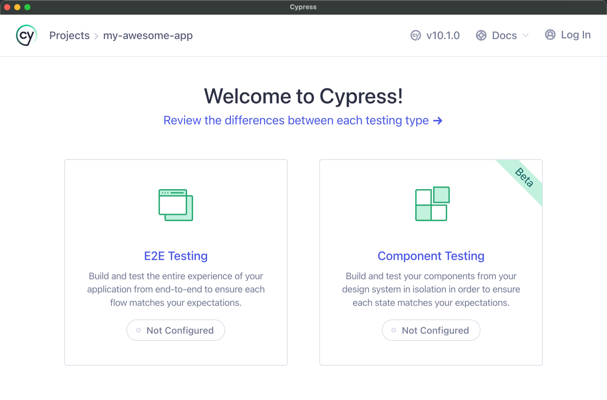
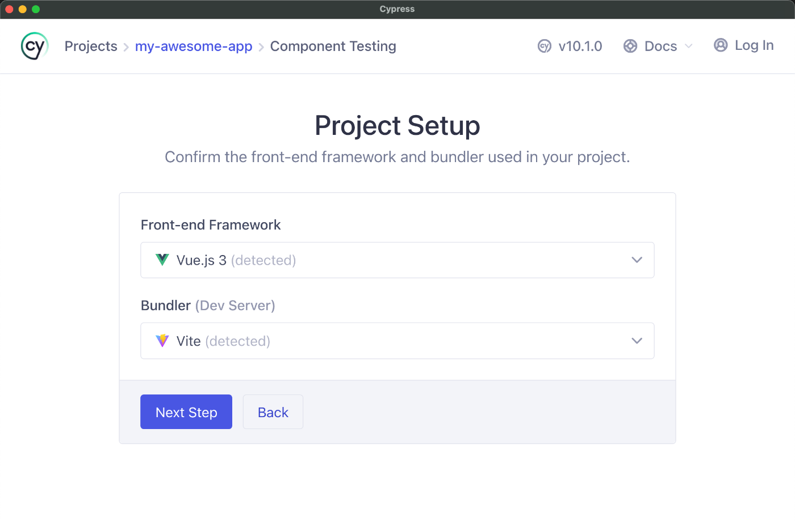
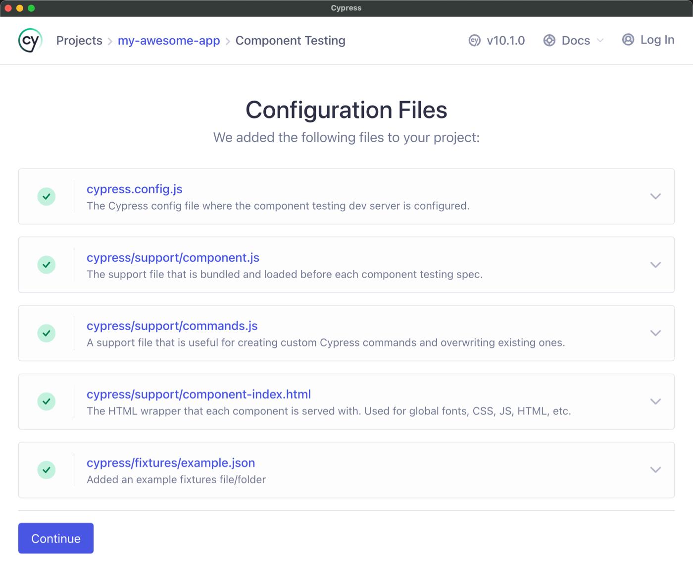
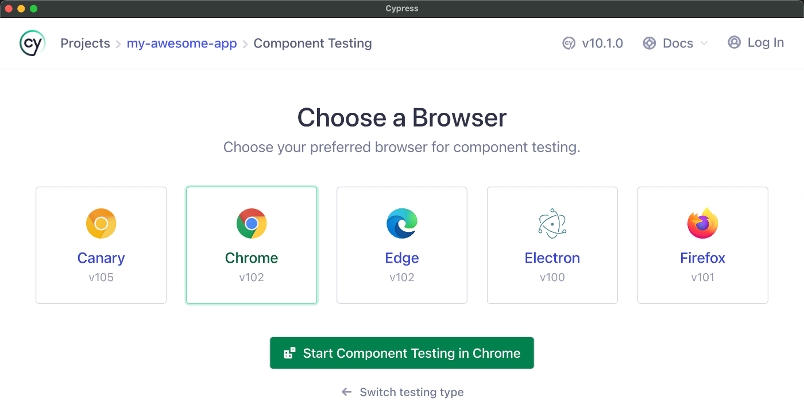

# Inicio rápido: Vue

:::warning Advertencia
Cypress Component Testing se encuentra actualmente en versión beta.
:::

Para seguir esta guía, necesitará una aplicación Vue.

La forma más rápida de comenzar a escribir pruebas de componentes para [Vue es usar la propia herramienta de andamiaje de proyectos de Vue](https://vuejs.org/guide/quick-start.html).

Para crear un proyecto Vue:

1. Ejecute el comando de andamio

```bash
npm init vue@latest
```

Siga las indicaciones para crear su aplicación. Durante la instalación, se le preguntará si desea instalar Cypress. Puede hacerlo ahora o en el siguiente paso.

2. Agregue Cypress si no lo seleccionó en las opciones de andamiaje de Vue

```bash
npm install cypress -D
```

3. ¡Abre Cypress y sigue las indicaciones del Launchpad!

```bash
npx cypress open
```

## Configuración de Pruebas de Componentes

Si seleccionó Cypress durante las opciones de andamiaje de Vue, la prueba de componentes estará configurada y lista para funcionar.

Si no lo hizo, cuando ejecute Cypress por primera vez en un proyecto, la aplicación le pedirá que configure **E2E Testing** o **Component Testing**. Elija **Component Testing ** y siga los pasos del asistente de configuración.



**Elija Component Testing**

La pantalla de configuración del proyecto detecta automáticamente su _framework_ y _bundler_, que es Vue y Vite en nuestro caso. Cypress Component Testing utiliza la configuración de su servidor de desarrollo existente para representar componentes, lo que ayuda a garantizar que sus componentes actúen y se muestren en las pruebas de la misma manera que lo hacen en producción



A continuación, la configuración de Cypress detectará su _framework_ y generará todos los archivos de configuración necesarios, y se asegurará de que todas las dependencias requeridas estén instaladas.



**La plataforma de lanzamiento de Cypress creará andamios para todos estos archivos por usted.**

Después de configurar la prueba de componentes, estará en la pantalla de selección del navegador.

Elija el navegador de su elección y haga clic en el botón **"Start Component Testing"** para abrir la aplicación Cypress.



**Elija su navegador**

## Creación de un Componente

En este punto, su proyecto está configurado pero aún no tiene componentes para probar.

En esta guía, usaremos un componente `<Stepper/>` con cero dependencias y un bit de estado interno, un **"counter"** que se puede incrementar y disminuir con dos botones.

>Si su componente usa complementos, solicitudes de red u otras configuraciones ambientales, necesitará trabajo adicional para montar su componente. Esto se trata en una [sección posterior](https://docs.cypress.io/guides/component-testing/custom-mount-vue).

Agregue el siguiente componente a su proyecto:

📃`Stepper.vue`
```vue
<script setup>
  import { ref } from 'vue'
  const props = defineProps(['initial'])

  const emit = defineEmits(['change'])

  const count = ref(props.initial || 0)
</script>

<template>
  <div>
    <button aria-label="decrement" @click="count--">-</button>
    <span data-cy="counter">{{ count }}</span>
    <button aria-label="increment" @click="count++">+</button>
  </div>
</template>
```

>Usamos la Composition API de Vue con `script setup` en esta guía, pero eso no es necesario para las pruebas de componentes de Cypress y también puede usar la Options API. Obtenga más información sobre [estilos de la API de Vue](https://vuejs.org/guide/introduction.html#api-styles).

## Próximos Pasos

A continuación, aprenderemos a montar el componente `<Stepper />` con el comando `mount`.
