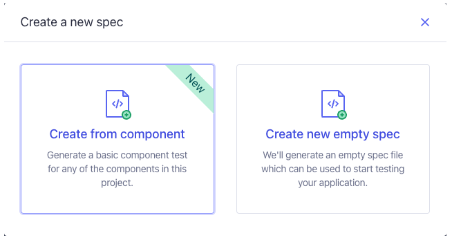
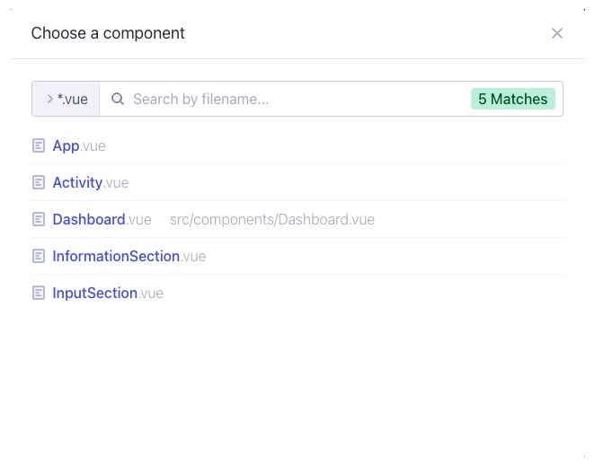
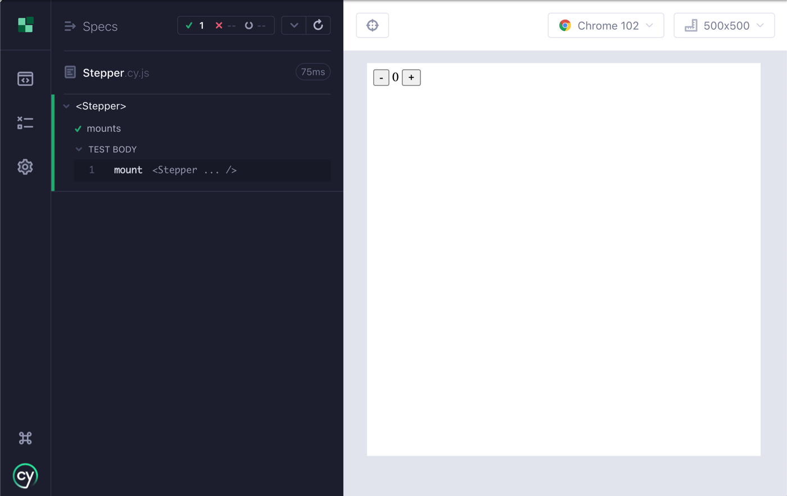

# Montando Componentes

Muchas pruebas, independientemente del _framework_ o el tipo, siguen un formato similar: **Arreglar, Actuar y Afirmar**. Este patrón _"Arreglar, Actuar, Afirmar"_ fue acuñado por primera vez en 2001 por Bill Wilke y se explica detalladamente en su publicación de blog ["3A - Arreglar, Actuar, Afirmar"](https://xp123.com/articles/3a-arrange-act-assert/).

Cuando se trata de pruebas de componentes, el montaje de su componente es donde **Arreglamos** nuestro componente bajo prueba. Es similar a visitar una página en una prueba de extremo a extremo (_end-to-end_).

## ¿Qué es la función Mount?

Enviamos una función `mount` para cada _framework_ de _frontend_ compatible con Cypress, que se importa del paquete cypress. Es responsable de renderizar los componentes dentro del _iframe_ de espacio aislado (_sandboxed_) de Cypress y del manejo y la limpieza específica del _framework_.

```js
import { mount } from 'cypress/vue'
```

## Usando `cy.mount()` En Cualquier Lugar

Si bien puede usar la función `mount` en sus pruebas, recomendamos usar [`cy.mount()`](https://docs.cypress.io/api/commands/mount), que se agrega como un [comando personalizado](https://docs.cypress.io/api/cypress-api/custom-commands) en el archivo `cypress/support/component.js`:

📃`cypress/support/component.js`
```js
import { mount } from 'cypress/vue'

Cypress.Commands.add('mount', mount)
```

Esto le permite usar `cy.mount()` en cualquier prueba de componente sin tener que importar el comando de montaje específico del framework.

Puede personalizar `cy.mount` para que se ajuste a sus necesidades. Por ejemplo, si está utilizando complementos u otras configuraciones globales a nivel de aplicación en su aplicación Vue, puede configurarlas aquí. Para obtener más información, consulte la [Guía de Personalización de cy.mount() para Vue](https://docs.cypress.io/guides/component-testing/custom-mount-vue).

## Su Primera Prueba de Componentes

Ahora que tiene un componente, escribamos una especificación que monte el componente.

Para comenzar, cree un archivo de especificaciones en el mismo directorio que el componente `Stepper.vue` y asígnele el nombre **Stepper.cy.js**. Luego pega lo siguiente en él:

📃`Stepper.cy.js`
```js
import Stepper from './Stepper.vue'

describe('<Stepper>', () => {
  it('mounts', () => {
    cy.mount(Stepper)
  })
})
```

Aquí, tenemos una sola prueba que asegura que nuestro componente se monta.

Si ya tiene un componente para el que desea crear una especificación, podemos crear la especificación por usted a través de la aplicación Cypress.

Haga clic en **"+ New Spec"**, seleccione **"Create from component"** y elija su componente de la lista.



**Crear a partir de la tarjeta de componentes**



**Crear a partir de la lista de componentes**

:::info
Si viene de _Vue Test Utils_, tenga en cuenta que no se usa el valor de retorno de `mount`. Las pruebas de _Cypress Component_ pueden y deben ser independientes de los componentes internos del _framework_ y rara vez es necesario acceder al [wrapper](https://test-utils.vuejs.org/api/#wrapper-methods) en el que se basan _Vue Test Utils_.
:::

## Ejecución de la Prueba

Ahora es el momento de ver la prueba en acción. Abra Cypress si aún no se está ejecutando:

```bash
npx cypress open --component
```

:::
La bandera `--component` nos llevará directamente a la prueba de componentes
:::

Y abre el navegador de tu elección. En la lista de especificaciones, haga clic en **Stepper.cy.js** y verá el componente paso a paso montado en el área de prueba.



**Prueba de Montaje Stepper**

Una prueba básica que monta un componente en su estado predeterminado es una excelente manera de comenzar a probar. Dado que Cypress representa su componente en un navegador real, tiene muchas ventajas, como ver que el componente se representa como debería, interactuar con el componente en el ejecutor de pruebas y usar las herramientas de desarrollo del navegador para inspeccionar y depurar ambas pruebas y el código del componente.

Siéntase libre de jugar con el componente `Stepper` interactuando con los botones de incremento y decremento.

## Soporte JSX opcional

El comando `mount` es compatible con la sintaxis de objetos de Vue Test Utils, pero también se puede usar con la sintaxis JSX de Vue (siempre que haya configurado su paquete para admitir la transpilación de archivos JSX o TSX).

La sintaxis del objeto para la función `mount` es idéntica a la versión de Vue Test Utils que usaría con la versión de Vue de su aplicación.

El resto de esta guía mostrará pruebas en la sintaxis de Vue Test Utils. Para JSX consulte la documentación oficial de Cypress.

## Cypress y Testing Library

Si bien Cypress no usa [Testing Library](https://testing-library.com/) en su guía, muchas personas podrían preguntarse si es posible hacerlo con Cypress y la respuesta es ¡sí!

Cypress ama el proyecto _Testing Library_. Utiliza _Testing Library_ internamente, y su filosofía se alinea estrechamente con el espíritu y el enfoque de _Testing Library_ para escribir pruebas. Apoyamos firmemente sus mejores prácticas.

En particular, si está buscando más recursos para comprender cómo le recomendamos que enfoque las pruebas de sus componentes, consulte:

- [Guiding Principles - Testing Library](https://testing-library.com/docs/guiding-principles/)
- [Priority of Queries - Testing Library](https://testing-library.com/docs/queries/about/#priority)

Para los fanáticos de [Testing Library](https://testing-library.com/docs/cypress-testing-library/intro/), querrá instalar `@testing-library/cypress` en lugar del paquete `@testing-library/vue`.

```bash
npm i -D @testing-library/cypress
```

Las instrucciones de configuración son las mismas para E2E y Pruebas de Componentes. Dentro de su archivo de soporte de componentes, importe los comandos personalizados.

```js
// cypress/support/component.js
// cy.findBy* commands will now be available.
// This calls Cypress.Commands.add under the hood
import '@testing-library/cypress/add-commands'
```

Para los usuarios de TypeScript, los tipos se empaquetan junto con el paquete _Testing Library_. Consulte las instrucciones de configuración más recientes en los documentos de _Testing Library_.

## Próximos Pasos

Ahora que tenemos nuestro componente montado, a continuación aprenderemos cómo escribir pruebas contra él.
