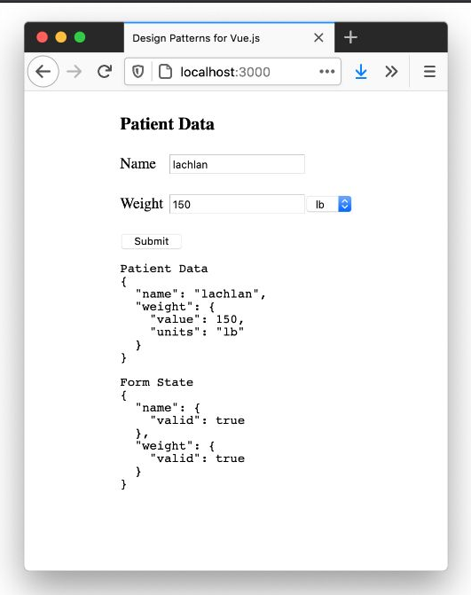
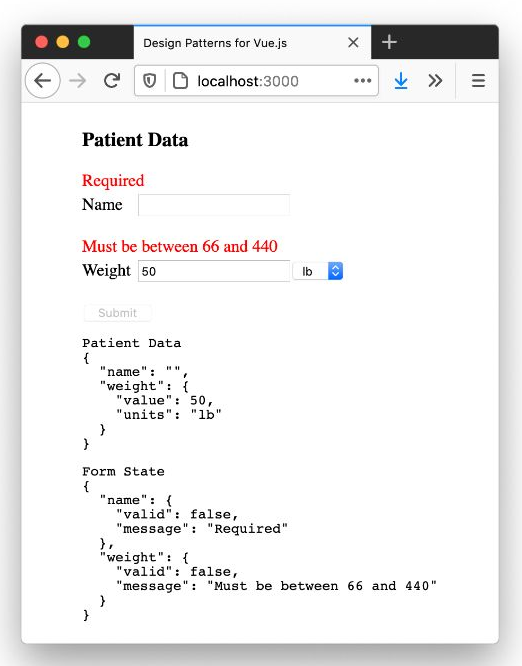

# Escribir Formularios Comprobables

Puede encontrar el código fuente completo (incluidos los ejercicios) en el repositorio de GitHub en [`examples/form-validatio`](https://github.com/lmiller1990/design-patterns-for-vuejs-source-code/tree/master/examples/form-validation).

---

Los formularios son la forma principal en que un usuario ingresa información en cualquier sistema basado en la web, por lo que es importante hacerlo bien. El enfoque de esta sección estará en los formularios, específicamente en _escribir buenos formularios_.

¿Qué es exactamente una _buen formulario_?

Queremos asegurarnos de que la lógica del formulario esté desacoplada de los componentes de Vue; esto nos permitirá probar de forma aislada. También tenemos que pensar en la validación.

En las aplicaciones tradicionales renderizadas por el servidor, solo obtendría la validación después de enviar el formulario, lo que no es una gran experiencia para el usuario. Vue nos permite ofrecer una excelente experiencia de usuario al implementar una validación del lado del cliente altamente dinámica. Haremos uso de esto e implementaremos dos niveles de validación:

1. **Validación de campo**: si un usuario ingresa datos incorrectos o no válidos en un solo campo, mostraremos un error de inmediato.
2. **Validación del formulario**: el botón de envío solo debe habilitarse cuando todo el formulario se haya completado correctamente.

Finalmente, necesitamos dos tipos de pruebas. El primero es en torno a la lógica de negocio; dado algún formulario, qué campos no son válidos y cuándo se considera que el formulario está completo? El segundo tiene que ver con las interacciones: garantizar que la capa de la UI funcione correctamente y que el usuario pueda ingresar datos, ver mensajes de error y enviar el formulario si todos los campos son válidos.

## El Formulario del Paciente

Para este ejemplo, estamos creando un formulario para ingresar datos de pacientes para una aplicación de hospital. El formulario se verá así cuando se llene sin ningún error:



>Formulario válido con información de depuración

Hay dos entradas. El primero es el `name` del paciente, que es obligatorio y puede ser cualquier texto. El segundo es el `weight` del paciente, que puede estar en unidades métricas o imperiales. Las restricciones son las siguientes:

|Constraint|Imperial|Metric|
|-|-|-|
|min|66|30|
|max|440|200|

Necesitaremos validar tanto el `name` como el `weight`. El formulario con errores se ve así:



>Formulario no válido con información de depuración

Definiremos las restricciones usando un objeto:

```js
const limits = {
  kg: { min: 30, max: 200 },
  lb: { min: 66, max: 440 }
}
```

El botón **Submit** solo debe habilitarse si ambas entradas son válidas. Finalmente, debemos mostrar la validación para cada campo.

## Un Framework de Validación de Mini Formularios

Hay muchos frameworks de validación de formularios Vue (y no Vue) con todas las funciones. Para este ejemplo simple, escribiremos el nuestro; esto nos permitirá analizar algunas ideas y evitar aprender una API o biblioteca específica.

Necesitamos dos tipos de validaciones:

1. **Un campo obligatorio**. Tanto el `name` como el `weight` del paciente son campos obligatorios.
2. **Restricciones mínimas y máximas**. Esto es para el campo `weight`, tiene que estar dentro de un rango específico. También necesita admitir unidades métricas e imperiales.

Además de validar los campos, nuestro framework de validación de formularios también debería devolver un mensaje de error por cada entrada no válida.

Escribiremos dos funciones de validación: `required` y `isBetween`. Si bien el desarrollo dirigido por pruebas (abreviado como [TDD](../../comenzar/tdd.html), donde primero escribe las pruebas y deja que las pruebas fallidas guíen la implementación) no siempre es la herramienta adecuada, creo que para escribir estas dos funciones lo es. Esto se debe a que conocemos las entradas y salidas, y todos los posibles estados del sistema, solo es cuestión de escribir las pruebas y luego hacerlas pasar.

Hagámoslo, comenzando con las pruebas para el validador `required`. Cada validador devolverá un objeto con el estado de validación y un mensaje si hay un error. Una entrada validada debe tener esta forma:

```ts
interface ValidationResult {
  valid: boolean
  message?: string
}
```

Este será el formato al que deberán ajustarse nuestros dos validadores (y los futuros). Ahora que nos hemos decidido por nuestra API de validación, podemos escribir las pruebas para `required`.

## El validador `required`

📃`__tests__/form.spec.js`
```js
import { required } from '../form.js'

describe('required', () => {
  it('is invalid when undefined', () => {
    expect(required(undefined)).toEqual({
      valid: false,
      message: 'Required'
    })
  })
  
  it('is invalid when empty string', () => {
    expect(required('')).toEqual({
      valid: false,
      message: 'Required'
    })
  })

  it('returns true false value is present', () => {
    expect(required('some value')).toEqual({ valid: true })
  })
})
```
>Pruebas para el validador `required`.

Básicamente, todo lo que no se evalúe como verdadero no es válido; cualquier otra cosa se considera válida. Podemos hacer que todas las pruebas pasen con esta implementación:

📃`form.js`
```js
export function required(value) {
  if (!value) {
    return {
      valid: false,
      message: 'Required'
    }
  }
  return { valid: true }
}
```
>Implementación `required` del validador.

Me gusta verificar primero el caso `null`, cuando el valor no está definido. Eso es solo una preferencia personal.

## 5.4 The isBetween validator
