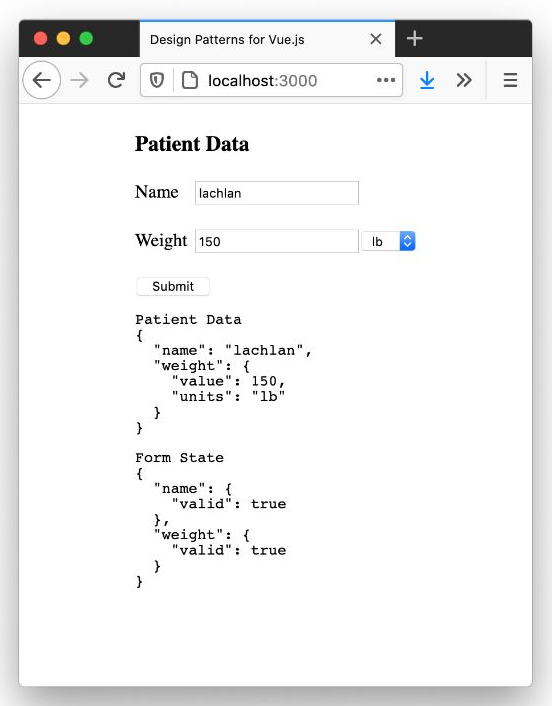

# Escribir Formularios Comprobables

Puede encontrar el código fuente completo (incluidos los ejercicios) en el repositorio de GitHub en [`examples/form-validatio`](https://github.com/lmiller1990/design-patterns-for-vuejs-source-code/tree/master/examples/form-validation).

---

Los formularios son la forma principal en que un usuario ingresa información en cualquier sistema basado en la web, por lo que es importante hacerlo bien. El enfoque de esta sección estará en los formularios, específicamente en _escribir buenos formularios_.

¿Qué es exactamente una _buen formulario_?

Queremos asegurarnos de que la lógica del formulario esté desacoplada de los componentes de Vue; esto nos permitirá probar de forma aislada. También tenemos que pensar en la validación.

En las aplicaciones tradicionales renderizadas por el servidor, solo obtendría la validación después de enviar el formulario, lo que no es una gran experiencia para el usuario. Vue nos permite ofrecer una excelente experiencia de usuario al implementar una validación del lado del cliente altamente dinámica. Haremos uso de esto e implementaremos dos niveles de validación:

1. **Validación de campo**: si un usuario ingresa datos incorrectos o no válidos en un solo campo, mostraremos un error de inmediato.
2. **Validación del formulario**: el botón de envío solo debe habilitarse cuando todo el formulario se haya completado correctamente.

Finalmente, necesitamos dos tipos de pruebas. El primero es en torno a la lógica de negocio; dado algún formulario, qué campos no son válidos y cuándo se considera que el formulario está completo? El segundo tiene que ver con las interacciones: garantizar que la capa de la UI funcione correctamente y que el usuario pueda ingresar datos, ver mensajes de error y enviar el formulario si todos los campos son válidos.

## El Formulario del Paciente

Para este ejemplo, estamos creando un formulario para ingresar datos de pacientes para una aplicación de hospital. El formulario se verá así cuando se llene sin ningún error:


>Formulario válido con información de depuración

Hay dos entradas. El primero es el `name` del paciente, que es obligatorio y puede ser cualquier texto. El segundo es el `weight` del paciente, que puede estar en unidades métricas o imperiales. Las restricciones son las siguientes:

|Constraint|Imperial|Metric|
|-|-|-|
|min|66|30|
|max|440|200|

Necesitaremos validar tanto el `name` como el `weight`. El formulario con errores se ve así:


>Formulario no válido con información de depuración

Definiremos las restricciones usando un objeto:

```js
const limits = {
  kg: { min: 30, max: 200 },
  lb: { min: 66, max: 440 }
}
```

El botón **Submit** solo debe habilitarse si ambas entradas son válidas. Finalmente, debemos mostrar la validación para cada campo.

## Un Framework de Validación de Mini Formularios

Hay muchos frameworks de validación de formularios Vue (y no Vue) con todas las funciones. Para este ejemplo simple, escribiremos el nuestro; esto nos permitirá analizar algunas ideas y evitar aprender una API o biblioteca específica.

Necesitamos dos tipos de validaciones:

1. **Un campo obligatorio**. Tanto el `name` como el `weight` del paciente son campos obligatorios.
2. **Restricciones mínimas y máximas**. Esto es para el campo `weight`, tiene que estar dentro de un rango específico. También necesita admitir unidades métricas e imperiales.

Además de validar los campos, nuestro framework de validación de formularios también debería devolver un mensaje de error por cada entrada no válida.

Escribiremos dos funciones de validación: `required` y `isBetween`. Si bien el desarrollo dirigido por pruebas (abreviado como [TDD](../../comenzar/tdd.html), donde primero escribe las pruebas y deja que las pruebas fallidas guíen la implementación) no siempre es la herramienta adecuada, creo que para escribir estas dos funciones lo es. Esto se debe a que conocemos las entradas y salidas, y todos los posibles estados del sistema, solo es cuestión de escribir las pruebas y luego hacerlas pasar.

Hagámoslo, comenzando con las pruebas para el validador `required`. Cada validador devolverá un objeto con el estado de validación y un mensaje si hay un error. Una entrada validada debe tener esta forma:

```ts
interface ValidationResult {
  valid: boolean
  message?: string
}
```

Este será el formato al que deberán ajustarse nuestros dos validadores (y los futuros). Ahora que nos hemos decidido por nuestra API de validación, podemos escribir las pruebas para `required`.

## El validador `required`

📃`__tests__/form.spec.js`
```js
import {
  required
} from '../form.js'

describe('required', () => {
  it('is invalid when undefined', () => {
    expect(required(undefined)).toEqual({
      valid: false,
      message: 'Required'
    })
  })
  
  it('is invalid when empty string', () => {
    expect(required('')).toEqual({
      valid: false,
      message: 'Required'
    })
  })

  it('returns true false value is present', () => {
    expect(required('some value')).toEqual({ valid: true })
  })
})
```
>Pruebas para el validador `required`.

Básicamente, todo lo que no se evalúe como verdadero no es válido; cualquier otra cosa se considera válida. Podemos hacer que todas las pruebas pasen con esta implementación:

📃`form.js`
```js
export function required(value) {
  if (!value) {
    return {
      valid: false,
      message: 'Required'
    }
  }
  return { valid: true }
}
```
>Implementación `required` del validador.

Me gusta verificar primero el caso `null`, cuando el valor no está definido. Eso es solo una preferencia personal.

## El validador `isBetween`

`isBetween` es un poco más interesante. Necesitamos admitir imperial y métrico; construiremos otra función encima de `isBetween` que pasará las restricciones correctas.

Comencemos identificando todos los casos extremos. Si el `weight` mínimo es `66 lb` y el `weight` es `440 lb`, obviamente `65 lb` y `441 lb` no son válidos. Sin embargo, `66 lb` y `440 lb` son válidos, por lo que debemos asegurarnos de agregar pruebas para esos casos.

Esto significa que necesitamos 5 pruebas:
1. El camino "feliz", donde la entrada es válida.
2. El valor está por encima del valor máximo.
3. El valor está por debajo del valor mínimo.
4. El valor es igual al valor máximo.
5. El valor es igual al valor mínimo.

Para esta función, es seguro asumir que solo se pueden pasar números como valor de entrada; esta validación es algo que manejaremos en un nivel superior.

📃`__tests__/form.spec.js`
```js
import {
  isBetween
  required,  
} from '../form.js'

describe('required', () => {
  // omitted for brevity ...
})

describe('isBetween', () => {
  it('returns true when value is equal to min', () => {
    expect(isBetween(5, { min: 5, max: 10 }))
      .toEqual({ valid: true })
  })

  it('returns true when value is between min/max', () => {
    expect(isBetween(7, { min: 5, max: 10 }))
      .toEqual({ valid: true })
  })

  it('returns true when value is equal to max', () => {
    expect(isBetween(10, { min: 5, max: 10 }))
      .toEqual({ valid: true })
  })

  it('returns false when value is less than min', () => {
    expect(isBetween(4, { min: 5, max: 10 }))
      .toEqual({
        valid: false,
        message: 'Must be between 5 and 10'
      })
  })

  it('returns false when value is greater than max', () => {
    expect(isBetween(11, { min: 5, max: 10 }))
      .toEqual({
        valid: false,
        message: 'Must be between 5 and 10'
    })
  })
})
```
>Pruebas para el validador `isBetween`.

Creo que las pruebas son lo suficientemente simples como para tener todo en una sola declaración de expectativa. Si las pruebas fueran más complejas, probablemente asignaría el resultado de `isBetween()` a una variable (me gusta llamarlo real) y lo pasaría a la afirmación esperada. Más información sobre la estructuración de pruebas más grandes y complejas más adelante.

La implementación es mucho menos código que las pruebas; esto no es inusual.

📃`form.js`
```js
export function isBetween(value, { min, max }) {
  if (value < min || value > max) {
    return {
      valid: false,
      message: `Must be between ${min} and ${max}`
    }
  }
  return { valid: true }
}

export function required(value) {
  // omitted for brevity ...
}
```
>Implementación del validador `isBetween`.

Nuevamente, me gusta tener la validación al comienzo de la función.

## Construyendo `validateMeasurement` con `isBetween`

Ahora que hemos escrito nuestro pequeño framework de validación (bueno, dos funciones), es hora de validar el `weight` del paciente. Construiremos una función de `validateMeasurement` utilizando `isBetween` y `required`.

Dado que admitimos el sistema métrico e imperial, pasaremos las restricciones como argumento. El manejo de cuál se selecciona se hará más adelante, en la capa de la UI.

Hay tres escenarios a considerar:

1. El camino feliz cuando el valor es válido.
2. El valor es nulo/indefinido.
3. El valor está definido, pero fuera de las restricciones.

No siento la necesidad de agregar pruebas para todos los casos como hicimos con `isBetween`, ya que ya lo probamos a fondo.

📃`__tests__/form.spec.js`
```js
import {
  isBetween,
  required,
  validateMeasurement
} from '../form.js'

describe('required', () => {
 // omitted for brevity ...
})

describe('isBetween', () => {
  // omitted for brevity ...
})

describe('validateMeasurement', () => {
  it('returns invalid for input', () => {
    const constraints = { min: 10, max: 30 }
    const actual = validateMeasurement(undefined, { constraints })

    expect(actual).toEqual({ valid: false, message: 'Required' })
  })

  it('returns invalid when outside range', () => {
    const constraints = { min: 10, max: 30 }
    const actual = validateMeasurement(40, { constraints })

    expect(actual).toEqual({
      valid: false,
      message: 'Must be between 10 and 30'
    })
  })
})
```
>Pruebas para el validador `validateMeasurement`.

Dado que la prueba es un poco más compleja, decidí asignar el resultado a `actual` y afirmar contra eso. Creo que esto lo deja más claro.

No necesitamos usar las restricciones específicas para libras y kilogramos descritas en la tabla anterior. Mientras las pruebas pasen con las restricciones que pasamos aquí, podemos estar seguros de que `validateMeasurement` funcionará correctamente para cualquier conjunto dado de restricciones `min`/`max`.

También dejé una línea en blanco entre el cuerpo de la prueba y la afirmación. Esta es una preferencia personal, vagamente inspirada en las tres fases de una prueba: **_arreglar_**, **_actuar_** y **_afirmar_**. Hablaremos de eso más tarde.

No tienes que escribir tus pruebas de esta manera. Encuentro útil pensar en términos de _"hacer cosas"_ (por ejemplo, crear algunas variables, llamar a algunas funciones) y afirmar (donde decimos _"dado este escenario, esto debería suceder"_).

Dejando a un lado la filosofía personal: la implementación, nuevamente, es mucho más corta que el código de prueba. ¿Notas un patrón? Es común que el código de prueba sea más largo que la implementación. Puede parecer un poco extraño al principio, pero no es un problema y se espera para una lógica compleja.

📃`form.js`
```js
export function isBetween(value, { min, max }) {
  // omitted for brevity ...
}

export function required(value) {
  // omitted for brevity ...
}

export function validateMeasurement(value, { constraints }) {
  const result = required(value)
  if (!result.valid) {
    return result
  }

  return isBetween(value, constraints)
}
```
>Componiendo `validateMeasurement` con `required` y `isBetween`.

Genial! Pudimos reutilizar `required` e `isBetween`. _“Compusimos”_ un validador usando dos pequeños. La reutilización es buena. La componibilidad es buena.

## El Objeto la Validación del Formulario Completo

Hemos completado todas las validaciones para cada campo. Pensemos ahora en la estructura del formulario.

Tenemos dos campos: `name` y `weight`.

1. `name` es una cadena.
2. `weight` es un número con unidades asociadas.

Estas son las _entradas_. Debe tener esta forma:

```ts
// definition
interface PatientFormState {
  name: string
  weight: {
    value: number
    units: 'kg' | 'lb'
  }
}

// usage
const patientForm: PatientFormState = {
  name: 'John',
  weight: {
    value: 445,
    units: 'lb'
  }
}
```

Objeto que describe al(a) paciente.

Dada una entrada (un `patientForm`), podemos validar cada campo. Los campos cuando se validan son `{ valid: true }` o `{ valid: false, message: '...' }`. Entonces, el formulario la interfaces de y validación podrían verse así:


```ts
interface ValidationResult {
  valid: boolean
  messsage?: string
}

interface PatientFormValidity {
  name: ValidationResult
  weight: ValidationResult
}

const patientForm: PatientFormState = {
  name: 'John',
  weight: {
    value: 445,
    units: 'lb'
  }
}

const validState = validateForm(patientForm)
// Return value should be:
// {
//   name: { valid: true }
//   weight: {
//     valid: false,
//     message: 'Must be between 66 and 440'
//   }
// }
```
>Ejemplo de uso de la función `validateForm` que escribiremos.

Necesitaremos dos funciones:

1. `isFormValid`, para decirnos si el formulario es válido o no.
2. `patientForm`, que se encarga de averiguar las unidades de peso correctas y llamar a todos los validadores

Comencemos con las pruebas para `isFormValid`. El formulario se considera válido cuando todos los campos son válidos, por lo que solo necesitamos dos pruebas: el caso en que todos los campos son válidos y el caso en que al menos un campo no lo es:

📃`__tests__/form.spec.js`
```js
import {
  isBetween,
  isFormValid,
  required,
  validateMeasurement  
} from '../form.js'

describe('required', () => {
  // omitted for brevity ...
})

describe('isBetween', () => {
  // omitted for brevity ...
})

describe('validateMeasurement', () => {
  // omitted for brevity ...
})

describe('isFormValid', () => {
  it('returns true when name and weight field are valid', () => {
    const form = {
      name: { valid: true },
      weight: { valid: true }
    }

    expect(isFormValid(form)).toBe(true)
  })

  it('returns false when any field is invalid', () => {
    const form = {
      name: { valid: false },
      weight: { valid: true }
    }

    expect(isFormValid(form)).toBe(false)
  })
})
```
>Probando `isFormValid`.

La implementación es simple:

📃`form.js`
```js{5,6,7}
export function isBetween(value, { min, max }) {
  // omitted for brevity ...
}

export function isFormValid(form) {
  return form.name.valid && form.weight.valid
}

export function required(value) {
  // omitted for brevity ...
}

export function validateMeasurement(value, { constraints }) {
  // omitted for brevity ...
}
```
>Implementación `isFormValid`.

Podría volverse elegante e iterar sobre el formulario usando `Object.keys` u `Object.entries` si estuviera creando una biblioteca de validación de formularios más genérica. Esta sería una solución más general. En este caso, lo estoy manteniendo lo más simple posible.

La última prueba que necesitamos para completar la lógica de negocios es el `patientForm`. Esta función toma un objeto con la interfaz `PatientFormState` que definimos anteriormente. Devuelve el resultado de la validación de cada campo.

Querremos tener bastantes pruebas aquí, para asegurarnos de que no nos perdemos nada. Los casos que se me ocurren son:

1. Camino feliz: todas las entradas son válidas
2. El nombre del paciente es nulo
3. El peso del paciente está fuera de las restricciones (imperial)
4. El peso del paciente está fuera de las restricciones (métrica)

📃`__tests__/form.spec.js`
```js
import {
  isBetween,
  isFormValid,
  patientForm,
  required,
  validateMeasurement  
} from '../form.js'

describe('required', () => {
  // omitted for brevity ...
})

describe('isBetween', () => {
  // omitted for brevity ...
})

describe('validateMeasurement', () => {
  // omitted for brevity ...
})

describe('isFormValid', () => {
  // omitted for brevity ...
})

describe('patientForm', () => {
  const validPatient = {
    name: 'test patient',
    weight: { value: 100, units: 'kg' }
  }

  it('is valid when form is filled out correctly', () => {
    const form = patientForm(validPatient)
    expect(form.name).toEqual({ valid: true })
    expect(form.weight).toEqual({ valid: true })
  })

  it('is invalid when name is null', () => {
    const form = patientForm({ ...validPatient, name: '' })
    expect(form.name).toEqual({ valid: false, message: 'Required' })
  })

  it('validates weight in imperial', () => {
    const form = patientForm({
      ...validPatient,
      weight: {
        value: 65,
        units: 'lb'
      }
    })

    expect(form.weight).toEqual({
      valid: false,
      message: 'Must be between 66 and 440'
    })
  })

  it('validates weight in metric', () => {
    const form = patientForm({
      ...validPatient,
      weight: {
        value: 29,
        units: 'kg'
      }
    })

    expect(form.weight).toEqual({
      valid: false,
      message: 'Must be between 30 and 200'
    })
  })
})
```
>Probando `patientForm`.

¡El código de prueba es bastante largo! Sin embargo, la implementación es trivial. En este ejemplo, solo estoy codificando las restricciones de `weight` en un objeto llamado `limits`. En un sistema del mundo real, probablemente los obtendría de una API y los pasaría a la función de `patientForm`.

📃`form.js`
```js
// omitted for brevity ...

const limits = {
  kg: { min: 30, max: 200 },
  lb: { min: 66, max: 440 },
}

export function patientForm(patient) {
  const name = required(patient.name)

  const weight = validateMeasurement(patient.weight.value, {
    nullable: false,
    constraints: limits[patient.weight.units]
  })

  return {
    name,
    weight
  }
}

// omitted for brevity ...
```
>Implementando el `patientForm`.

Esto completa la lógica de negocio para el formulario del paciente. ¿Notó que aún no hemos escrito los componentes de Vue? Eso es porque nos estamos adhiriendo a uno de nuestros objetivos; separación de preocupaciones y el aislamiento total de la lógica de negocio.

## Escribir la capa de UI

Ahora la parte divertida: escribir la capa de la interfaz de usuario con Vue. Aunque creo que TDD es ideal para la lógica de negocio, generalmente no uso TDD para mis pruebas de componentes.

Me gusta comenzar pensando en cómo administraré el estado de mi componente. Usemos la Composition API; Creo que funciona muy bien para los formularios.

📃`FormValidation.spec.js.js`
```vue
<script>
import { reactive, computed, ref } from 'vue'
import { patientForm, isFormValid } from '@/utils/form.js'
export default {
  emits: ['submit'],
  setup(props, { emit }) {
    const form = reactive({
      name: '',
      weight: {
        value: '',
        units: 'kg'
      }
    })
    const validatedForm = computed(() => {
      return patientForm(form)
    })
    const submit = () => {
      emit('submit', { patient: form })
    }
    const valid = computed(() => isFormValid(validatedForm.value))
    return {
      form,
      validatedForm,
      submit,
      valid,
    }
  }
}
</script>
```
>Integrando la lógica de negocios del formulario y la capa de UI de Vue.

Decidí mantener el estado en un objeto `reactive`. Tanto el estado `valid` como el `validateForm` son valores `computed`: queremos que la validación y el estado del formulario se actualicen de forma reactiva cuando cambie cualquier valor en el formulario.

Agreguemos la parte `<template>` ahora: es muy simple, solo un buen HTML antiguo.

📃`FormValidation.spec.js.js`
```vue
<template>
  <div class="form-wrapper">
    <h3>Patient Data</h3>
    <form @submit.prevent="submit">
      <div class="field">
        <div v-if="!validatedForm.name.valid" class="error" role="error">
          {{ validatedForm.name.message }}
        </div>
        <label for="name">Name</label>
        <input id="name" name="name" role="name" v-model="form.name" />
      </div>
      <div class="field">
        <div v-if="!validatedForm.weight.valid" class="error" role="error">
          {{ validatedForm.weight.message }}
        </div>
        <label for="weight">Weight</label>
        <input id="weight" role="weight" name="weight" type="number" v-model.number="form.weight.value" />
        <select id="weight-units" role="weight-units" v-model="form.weight.units">
          <option value="kg">kg</option>
          <option value="lb">lb</option>
        </select>
      </div>
      <div class="field">
        <button role="submit" :disabled="!valid">Submit</button>
      </div>
    </form>
    <div>
<pre>
Patient Data
{{ form }}
</pre>

<pre>
Form State
{{ validatedForm }}
</pre>
    </div>
  </div>
</template>
```
>Un _template_ simple con enlaces v-model de formulario.

Agrego el bloque `<pre>` para algunas depuraciones.

📃`FormValidation.spec.js.js`
```vue
<style>
.field > label {
  display: inline-block;
  width: 50px;
  margin: 0 0 20px 0;
}
.field > input {
  display: inline-block;
  margin: 2px;
}
.error {
  color: red;
}
pre {
  display: flex;
  justify-content: flex-start;
}
.form-wrapper {
}
</style>
```
>Un poco de estilo

¡Todo funciona!



>Información de depuración de validación

## Algunas Pruebas Básicas de IU

También podemos agregar algunas pruebas de UI básicas usando Testing Library. Aquí hay dos bastante simples que cubren la mayor parte de la funcionalidad:

📃`__tests__/FormValidation.spec.js.js`
```js
import { render, screen, fireEvent } from '@testing-library/vue'
import FormValidation from '@/components/FormValidation.vue'

describe('FormValidation', () => {
  it('fills out form correctly', async () => {
    render(FormValidation)

    await fireEvent.update(screen.getByLabelText('Name'), 'lachlan') 
    await fireEvent.update(screen.getByDisplayValue('kg'), 'lb')
    await fireEvent.update(screen.getByLabelText('Weight'), '150')

    expect(screen.queryByRole('error')).toBe(null)
  })

  it('shows errors for invalid inputs', async () => {
    render(FormValidation)

    await fireEvent.update(screen.getByLabelText('Name'), '')
    await fireEvent.update(screen.getByLabelText('Weight'), '5')
    await fireEvent.update(screen.getByDisplayValue('kg'), 'lb')

    expect(screen.getAllByRole('error')).toHaveLength(2)
  })

  it('emits a submit event with patientForm when valid form submitted', async () => {
    const { emitted } = render(FormValidation)

    await fireEvent.update(screen.getByLabelText('Name'), 'lachlan')
    await fireEvent.update(screen.getByLabelText('Weight'), '150')
    await fireEvent.update(screen.getByDisplayValue('kg'), 'lb')
    await fireEvent.click(screen.getByText('Submit'))

    expect(emitted().submit[0]).toEqual([
      {
        patient: {
          name: 'lachlan',
          weight: {
            value: 150,
            units: 'lb'
          }
        }
      }
    ])
  })
})
```

Dado que estas pruebas son un poco más grandes, dejo clara la separación entre cada paso. Me gusta escribir mis pruebas así:

```js
it('...', async () => {
  // Arrange - this is where we set everything up
  render(FormValidation)

  // Act - do things!
  // Call functions
  // Assign values
  // Simulate interactions
  await fireEvent.update(screen.getByLabelText('Name'), 'lachlan')

  // Assert
  expect(...).toEqual(...)
})
```
>Anatomía de una prueba: arreglar, actuar, afirmar.

Usando Test Utils

📃`__tests__/FormValidation.spec.js.js`
```js
import { mount } from '@vue/test-utils'
import FormValidation from '@/components/FormValidation.vue'

describe('FormValidation', () => {
  it('fills out form correctly', async () => {
    const wrapper = mount(FormValidation)

    await wrapper.find('[role="name"]').setValue('lachlan')
    await wrapper.find('[role="weight-units"]').setValue('lb')
    await wrapper.find('[role="weight"]').setValue('150')

    expect(wrapper.findAll('[role="error"]')).toHaveLength(0)
  })

  it('shows errors for invalid inputs', async () => {
    const wrapper = mount(FormValidation)

    await wrapper.find('[role="name"]').setValue('')
    await wrapper.find('[role="weight-units"]').setValue('lb')
    await wrapper.find('[role="weight"]').setValue('50')

    expect(wrapper.findAll('[role="error"]')).toHaveLength(2)
  })

  it('emits a submit event with patientForm when valid form submitted', async () => {
    const wrapper = mount(FormValidation)

    await wrapper.find('[role="name"]').setValue('lachlan')
    await wrapper.find('[role="weight-units"]').setValue('kg')
    await wrapper.find('[role="weight"]').setValue('100')
    await wrapper.find('[role="submit"]').trigger('submit.prevent')

    expect(wrapper.emitted('submit')[0]).toEqual([
      {
        patient: {
          name: 'lachlan',
          weight: {
            value: 100,
            units: 'kg'
          }
        }
      }
    ])
  })
})
```
No tenemos ninguna prueba para asegurarnos de que el `<button>` esté deshabilitado correctamente; consulta más abajo para obtener más información.

## Mejoras y Conclusión

El objetivo aquí no era crear el formulario _perfecto_, sino ilustrar cómo separar la validación de su formulario y la lógica de negocio de la capa de la UI.

Tal como está, puede ingresar cualquier cadena en el campo de peso y se considerará válida, no ideal, pero también trivial de corregir. Un buen ejercicio sería escribir algunas pruebas para asegurarse de que la entrada sea un número y, de no ser así, devolver un mensaje de error útil. Tampoco tenemos ninguna prueba para garantizar que el `<button>` esté deshabilitado correctamente.

## Ejercicios

- Agregue una prueba para asegurarse de que cualquier valor no numérico ingresado en el campo de `weight` haga que el campo deje de ser válido y muestre el error _"Weight must be a number"_.
- Agregue un oyente `@submit.prevent` a `<form>`. Cuando se envíe el formulario, emita un evento con el `patientForm`.
- Envíe el formulario mediante Testing Library y confirme que se emiten el evento y la carga útil correctos.

Puede encontrar el código fuente completo (incluidos los ejercicios) en el [repositorio de GitHub en examples/form-validation](https://github.com/lmiller1990/design-patterns-for-vuejs-source-code).
.
